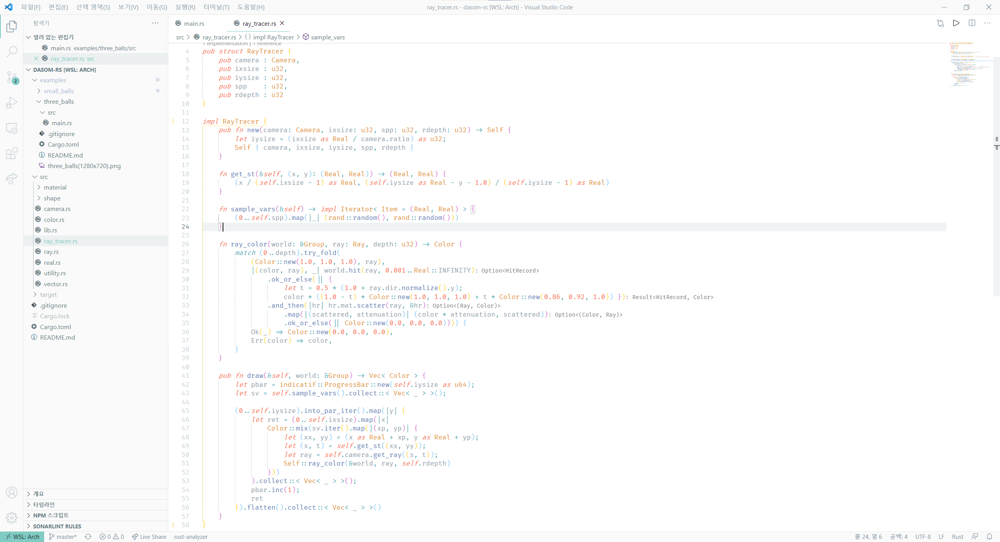

# vscode에 대하여

Visual Studio Code\(이하 vscode\)는 여러 운영체제에서 사용 가능한 에디터입니다. 에디터와 IDE\(통합 개발 환경\)의 차이에 대해 잠깐 짚고 넘어가겠습니다.

에디터는 텍스트 파일을 편집할 수 있는 프로그램입니다. 대표적으로 메모장, vscode, Vim 등이 있습니다. 메모장은 단순한 편집 기능만 제공하는데 비해, 코딩용 에디터들은 자동 들여쓰기나 코드 하이라이팅 등 편리한 기능들을 제공합니다. 또한, 플러그인들을 사용해 원하는 기능들을 덧붙일 수도 있습니다.

IDE는 이러한 IDE에 컴파일, 디버깅 등의 기능을 추가시킨 프로그램입니다. 대표적으로 Visual Studio, IntelliJ IDEA, Code::Blocks 등이 있습니다.

에디터는 원하는 언어의 플러그인을 설치하면 에디터 하나로 많은 언어를 커버할 수 있지만, IDE는 사용 가능한 언어에 제약이 있습니다. 하지만 IDE는 지원하는 언어에 한해 에디터보다 강력한 기능들을 제공하기도 합니다.

vscode는 가장 인기있는 에디터 중 하나입니다. 다양한 플러그인을 통해 한 에디터에서 여러 언어의 개발이 가능하고, GitHub와의 연동도 쉽습니다. 또한, Windows에서는 WSL\(및 WSL2\)로 접속해 개발할 수 있다는 장점도 있습니다.

우리는 vscode를 기반으로 각 언어별 개발 환경을 만들 것입니다.

