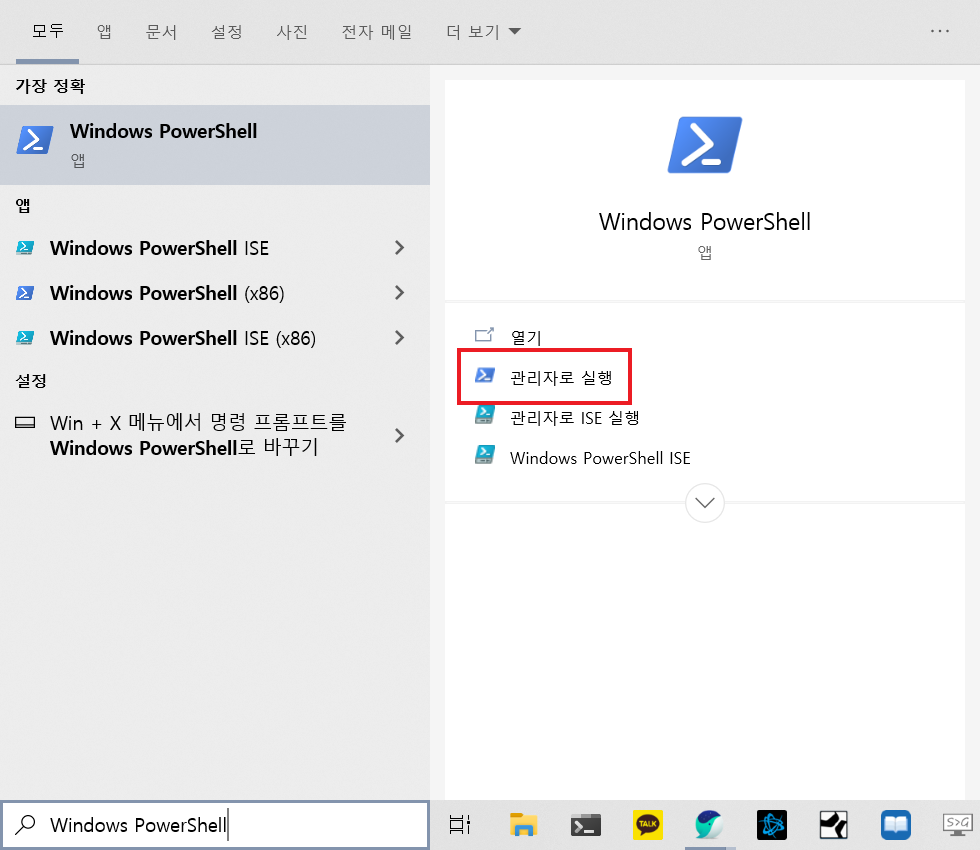

# WSL2 활성화

## 요구 사항 확인

WSL2 활성화를 위해서는 다음의 사항들을 만족해야 합니다.

* Windows 10 빌드 번호 18362 이상
* 64비트 운영체제

`Win` + `s` 키를 눌러 `PC 정보`를 입력하면 이상의 내용을 확인할 수 있습니다.

## WSL 활성화



1. `Win` + `s` 키를 눌러 `Windows PowerShell`을 입력하고 `관리자로 실행`을 누릅니다.
2. PowerShell에 다음의 내용을 차례로 입력한 후, [업데이트](https://wslstorestorage.blob.core.windows.net/wslblob/wsl_update_x64.msi)를 설치합니다.

```text
dism.exe /online /enable-feature /featurename:Microsoft-Windows-Subsystem-Linux /all /norestart
dism.exe /online /enable-feature /featurename:VirtualMachinePlatform /all /norestart
```

## WSL2 전환

1. 아까와 동일한 방법으로 PowerShell을 엽니다.
2. PowerShell에 다음의 내용을 입력합니다.

```text
wsl --set-default-version 2
```

이제 WSL2를 통해 Linux를 설치할 준비가 되었습니다.

